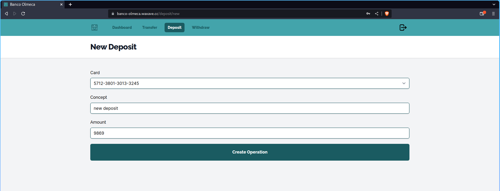

# Banco Olmeca App
Application that simulates a small bank

# Installation

This app uses the **Ruby on Rails** stack **Postgres** for the database

 - Ruby version: 3.2.1
 - Rails version: 7.0.4

## Install ruby
To install **Ruby** i'm using [asdf](https://asdf-vm.com/guide/getting-started.html) version manager
```sh
asdf install
```
## Install application dependencies
```sh
# if you don't have it
gem install bundler

# application dependencies
bundle install
```

## Create database
```sh
bundle exec rails db:create
bundle exec rails db:migrate
```
## Start the application
```sh
./bin/dev
```

# Navigating the app

Live url: [Banco Olmeca](https://banco-olmeca.waxave.cc/)
## Create a new user


## Login


## Dashboard


## Operations

 - Transfer

 - Deposit

 - Withdrawal

